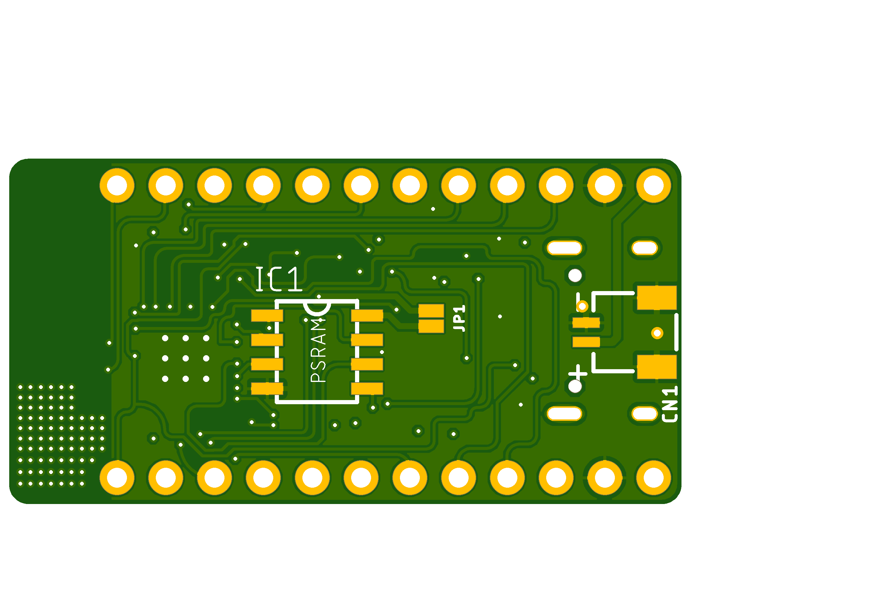
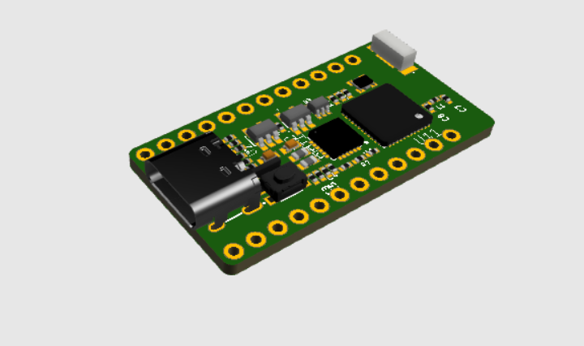

# Vector-IoT
Vector IoT : World’s smallest and powerful fully opensource  fully-featured ESP32 development board designed to unlock the power of the ESP32’s dual-core 240MHz and internet connectivity, in a package smaller than your thumb!

 ~ Current Status: Prototype boards sponsored by jlcpcb.com ~
     
     Note: This design was performed in Eagle 9.2.0 , you will need a atleast eagle 9.2.0 or higher version to open and edit these source files. 
           # Chance for bugs : High

# Rendered Footage of the PCB

## Licence
 * Hardware in this repository is licenced under Creative Commons BY-SA

 ## OSHW Certification
 TBD (Will apply when prototypes tested)

